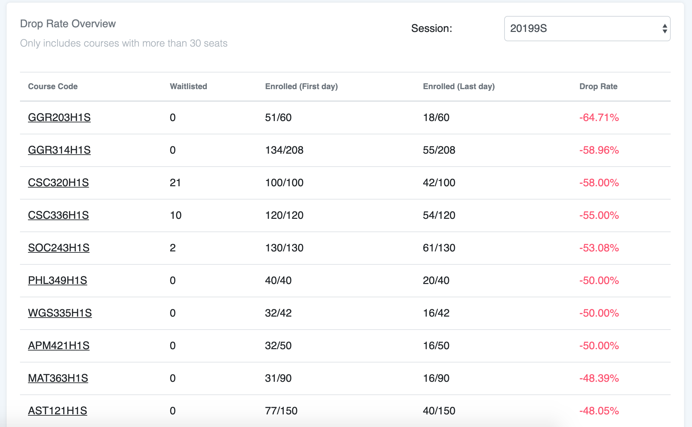

# Introduction

### What

This project is intended to track the drop rate of classes at University of Toronto St. George Campus.

User can access the list of most and least dropped classes, as well as the historical enrolment of a class over the course of a semester.

### Why

Difficulty of a class can be hard to gauge. One of the biggest problem facing UofT students is that there are no readily available data of how hard a class is, except by word of mouth.

This application attempts to compile the list of most dropped course by tracking daily enrolment through the official website.

# Technology

### Frontend

- React
- JavaScript

### Backend 

- NodeJs 
- Express
- PostgresSQL
- Python (hosted on AWS Lambda)
